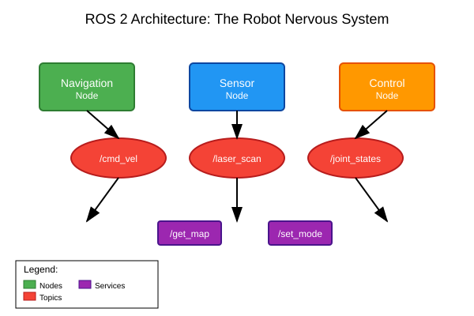

# Chapter 1: Introduction to ROS 2

## Explanation

Robot Operating System 2 (ROS 2) is not an actual operating system, but rather a flexible framework for writing robot software. It's a collection of tools, libraries, and conventions that aim to simplify the task of creating complex and robust robot behavior across a wide variety of robot platforms and environments.

ROS 2 serves as the "nervous system" of a robot, enabling different software components to communicate with each other. It provides services such as hardware abstraction, device drivers, libraries for implementing commonly used functionality, message-passing between processes, package management, and more.

The "2" in ROS 2 indicates that it's a complete redesign of the original ROS framework to address limitations like real-time support, security, and deployment in production environments. ROS 2 is designed to be suitable for real-world applications, not just research prototypes.

## Example

A practical example of ROS 2 in action is a mobile robot that needs to navigate through a building. The robot might have separate software components (called "nodes") for:

- A camera driver node that captures images
- A localization node that determines where the robot is in the building
- A path planning node that figures out how to get to the destination
- A motor control node that moves the robot's wheels
- A safety node that stops the robot if obstacles are detected

These nodes communicate with each other using ROS 2's messaging system, allowing the robot to function as a cohesive system despite being composed of many separate software components.

## Diagram



*Alt-text: Diagram showing multiple rectangular boxes labeled "Camera Node", "Localization Node", "Path Planning Node", and "Motor Control Node". Arrows with labels "sensor_data", "position", "path", and "motor_commands" connect the boxes, showing how nodes communicate through ROS 2 topics.*

## Code

Here's a simple example of a ROS 2 publisher node that broadcasts a message:

```python
# publisher_member_function.py
import rclpy
from rclpy.node import Node
from std_msgs.msg import String


class MinimalPublisher(Node):

    def __init__(self):
        super().__init__('minimal_publisher')
        self.publisher_ = self.create_publisher(String, 'topic', 10)
        timer_period = 0.5  # seconds
        self.timer = self.create_timer(timer_period, self.timer_callback)
        self.i = 0

    def timer_callback(self):
        msg = String()
        msg.data = f'Hello World: {self.i}'
        self.publisher_.publish(msg)
        self.get_logger().info(f'Publishing: "{msg.data}"')
        self.i += 1


def main(args=None):
    rclpy.init(args=args)

    minimal_publisher = MinimalPublisher()

    rclpy.spin(minimal_publisher)

    # Destroy the node explicitly
    minimal_publisher.destroy_node()
    rclpy.shutdown()


if __name__ == '__main__':
    main()
```

### Verification Steps

1. Save the code as `publisher_member_function.py`
2. Open a terminal and source your ROS 2 environment:
   ```bash
   source /opt/ros/humble/setup.bash
   ```
3. Navigate to your ROS 2 workspace and run the publisher:
   ```bash
   python3 publisher_member_function.py
   ```
4. You should see messages being published approximately every 0.5 seconds

## Practice Task

Create a simple subscriber node that listens to the "topic" and logs the received messages.

### Task Requirements

- Create a new ROS 2 node that subscribes to the 'topic' topic
- Implement a subscription callback that processes incoming messages
- Log the received messages to the console

### Expected Outcome

A subscriber node that prints messages received from the publisher node.

### Verification Steps

1. Run the publisher node from the code example above
2. In a separate terminal, run your subscriber node
3. Observe that your subscriber node logs messages from the publisher
4. Confirm that the messages are received in real-time

## Summary

This chapter introduced the fundamental concepts of ROS 2, including its role as a robot's "nervous system" and how it enables different software components to communicate. You learned about the ROS 2 architecture through a practical example and saw a simple publisher node in action.

## Next Steps

In the next chapter, you'll learn about ROS 2 nodes and communication patterns in more detail, diving deeper into how nodes interact with each other.

## Additional Resources

- [ROS 2 Documentation](https://docs.ros.org/)
- [ROS 2 Tutorials](https://docs.ros.org/en/humble/Tutorials.html)
- [ROS 2 Concepts Overview](https://docs.ros.org/en/humble/Concepts.html)