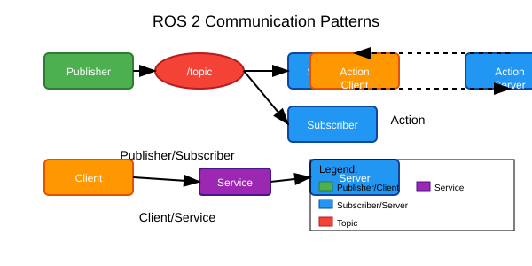

# Chapter 3: Topics and Services

## Explanation

ROS 2 provides two primary communication patterns: topics and services. Topics enable asynchronous, many-to-many communication through a publish-subscribe model, while services enable synchronous, one-to-one communication through a request-response model.

Topics are used for continuous data streams like sensor data, robot state information, or commands. Multiple publishers can send messages to a single topic, and multiple subscribers can receive messages from the same topic. This creates a decoupled system where publishers and subscribers don't need to know about each other.

Services, on the other hand, are used for discrete requests that require a specific response. A service client sends a request to a service server, waits for the response, and then continues execution. This is useful for operations like saving a map, changing robot modes, or executing a specific action that returns a result.

Both topics and services use message types that define the structure of the data being exchanged. These message types are defined in .msg files for topics and .srv files for services, ensuring type safety and enabling tools to understand the data format.

## Example

A practical example of topics and services working together is in a robot navigation system. The robot's laser scanner continuously publishes sensor data to a topic like "scan" which is used by multiple nodes: a mapping node, a localization node, and an obstacle detection node.

Meanwhile, the navigation system might use services for specific actions: a "set_goal" service to accept destination coordinates from a user interface, and a "get_path" service to request a path plan from a path planning node. This combination allows for continuous sensor data flow while enabling specific command and control functions.

## Diagram



*Alt-text: Diagram showing multiple nodes connected through different communication patterns. "Laser Scanner" node publishes to "scan" topic, which connects to "Mapping Node", "Localization Node", and "Obstacle Detection Node". Separately, "Navigation Node" provides a "set_goal" service connected to "User Interface" client, and a "get_path" service connected to "Path Planner" client. Topic communication shown with arrows and service communication shown with bidirectional arrows.*

## Code

Here's an example of both topic and service implementations in ROS 2:

```python
# topics_and_services_demo.py
import rclpy
from rclpy.node import Node
from std_msgs.msg import String
from example_interfaces.srv import AddTwoInts


class TopicsAndServicesDemo(Node):

    def __init__(self):
        super().__init__('topics_and_services_demo')

        # Create a publisher for a topic
        self.publisher_ = self.create_publisher(String, 'demo_topic', 10)

        # Create a subscription
        self.subscription = self.create_subscription(
            String,
            'command_topic',
            self.command_callback,
            10)

        # Create a service server
        self.srv = self.create_service(
            AddTwoInts,
            'add_two_ints',
            self.add_two_ints_callback
        )

        # Timer to periodically publish messages
        self.timer = self.create_timer(2.0, self.timer_callback)

        self.get_logger().info('Topics and Services Demo node started')

    def timer_callback(self):
        msg = String()
        msg.data = f'Demo message at {self.get_clock().now()}'
        self.publisher_.publish(msg)
        self.get_logger().info(f'Published: "{msg.data}"')

    def command_callback(self, msg):
        self.get_logger().info(f'Received command: "{msg.data}"')
        # Process the command here
        response_msg = String()
        response_msg.data = f'Processed: {msg.data}'
        # In a real system, you might publish a response to another topic
        self.publisher_.publish(response_msg)

    def add_two_ints_callback(self, request, response):
        result = request.a + request.b
        response.sum = result
        self.get_logger().info(f'Request: {request.a} + {request.b} = {response.sum}')
        return response


def main(args=None):
    rclpy.init(args=args)

    demo_node = TopicsAndServicesDemo()

    try:
        rclpy.spin(demo_node)
    except KeyboardInterrupt:
        pass
    finally:
        demo_node.destroy_node()
        rclpy.shutdown()


if __name__ == '__main__':
    main()
```

### Verification Steps

1. Save the code as `topics_and_services_demo.py`
2. Open a terminal and source your ROS 2 environment:
   ```bash
   source /opt/ros/humble/setup.bash
   ```
3. Navigate to your ROS 2 workspace and run the node:
   ```bash
   python3 topics_and_services_demo.py
   ```
4. In another terminal, test the service:
   ```bash
   ros2 service call /add_two_ints example_interfaces/AddTwoInts "{a: 2, b: 3}"
   ```
5. In yet another terminal, publish to the command topic:
   ```bash
   ros2 topic pub /command_topic std_msgs/String "data: 'test command'"
   ```
6. You should see the node responding to both the service call and topic messages

## Practice Task

Create a simple calculator service that can perform multiple operations (add, subtract, multiply, divide) and a topic publisher that periodically publishes the results of these operations.

### Task Requirements

- Create a custom service message for calculator operations
- Implement the service server with all four operations
- Create a client node that sends requests to the service
- Implement a publisher that broadcasts calculation results

### Expected Outcome

A complete system with a calculator service, client, and result publisher working together.

### Verification Steps

1. Run the calculator service server
2. Run the client that sends calculation requests
3. Verify that the results are published to the result topic
4. Confirm that all operations (add, subtract, multiply, divide) work correctly

## Summary

This chapter explored the two primary communication patterns in ROS 2: topics for asynchronous, many-to-many communication and services for synchronous, one-to-one communication. You learned when to use each pattern and saw examples of how they work together in real robot systems.

## Next Steps

In the next chapter, you'll learn about ROS 2 tools and best practices that will help you develop, debug, and maintain your robotic applications effectively.

## Additional Resources

- [ROS 2 Topics Documentation](https://docs.ros.org/en/humble/Concepts/About-Topics.html)
- [ROS 2 Services Documentation](https://docs.ros.org/en/humble/Concepts/About-Services.html)
- [ROS 2 Message Types](https://docs.ros.org/en/humble/Concepts/About-ROS-Interfaces.html)
- [ROS 2 Tools Overview](https://docs.ros.org/en/humble/How-To-Guides/Using-the-Ros2-Command-Line-Tools.html)