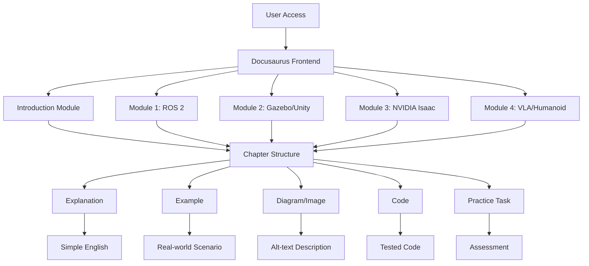
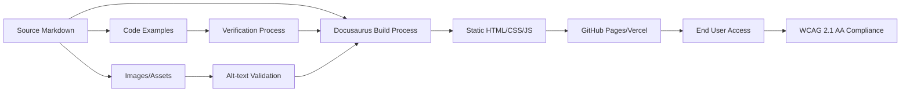
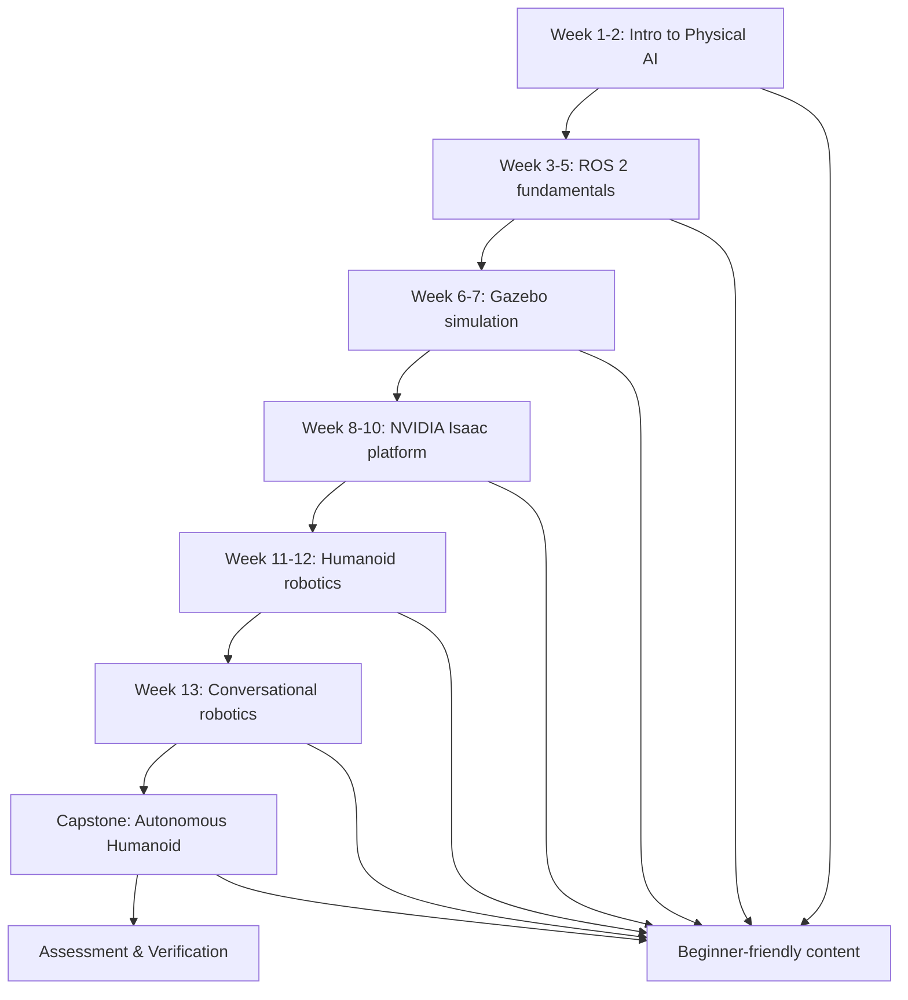

# Implementation Plan: 12-Chapter Physical AI & Humanoid Robotics Book

**Branch**: `01-physical-ai-book` | **Date**: 2025-12-12 | **Spec**: ./spec.md
**Input**: Feature specification from `/specs/01-physical-ai-book/spec.md`

**Note**: This template is filled in by the `/sp.plan` command. See `.specify/templates/commands/plan.md` for the execution workflow.

## Summary

This plan outlines the technical approach for creating a "12-Chapter Physical AI & Humanoid Robotics Book" using Docusaurus. The book will teach beginner to intermediate students in AI, robotics, and computer science how to bridge the gap between digital AI and embodied intelligence in the physical world. It will cover ROS 2, Gazebo, NVIDIA Isaac, Unity, and Vision-Language-Action systems with a focus on practical applications and runnable examples.

## Technical Context

**Language/Version**: Markdown for Docusaurus documentation, Python 3.x for code examples and simulations
**Primary Dependencies**: Docusaurus, Node.js, ROS 2 (Humble/Iron), Gazebo, NVIDIA Isaac, Unity
**Storage**: N/A (book content, not an application with persistent storage)
**Testing**: Manual verification of code examples and simulations, automated build testing for Docusaurus
**Target Platform**: Web-based (Docusaurus-generated static site), deployable on GitHub Pages and Vercel
**Project Type**: Documentation/Educational Content (Markdown files for Docusaurus)
**Performance Goals**: 99.9% uptime, <2s page load time, support 1000 concurrent users
**Constraints**:
- Writing level: simple English, beginner-friendly
- All images must include alt-text for WCAG 2.1 AA compliance
- All code examples must be tested and runnable
- Docusaurus formatting following Markdown standards
- Repository must remain deployable
- Content must be original with no plagiarism
**Scale/Scope**: 12 chapters + 4 modules + capstone project, following 13-week learning plan

## Constitution Check

*GATE: Must pass before Phase 0 research. Re-check after Phase 1 design.*

-   **I. Beginner-friendly clarity**: Writing will use simple English and easy explanations suitable for students new to physical AI concepts. (Pass)
-   **II. Accuracy**: Technical accuracy will be maintained for all robotics, ROS 2, Gazebo, NVIDIA Isaac, Unity, and Vision-Language-Action content. All instructions will be verified through official documentation. (Pass)
-   **III. Reproducibility**: Every step, command, and code example will be repeatable and testable. All procedures will work when followed by users, with clear verification steps included. (Pass)
-   **IV. Practical focus**: Emphasis will be on real robot workflows, examples, diagrams, and hands-on practical applications rather than theoretical concepts alone. (Pass)
-   **V. Structured presentation**: Content will follow a structured format of 12 chapters with 4 modules and a weekly learning plan. Each chapter will include: explanation → example → diagram → code → practice task. (Pass)
-   **VI. Originality and Verification**: All content will be original with no plagiarism. All code will be runnable and verified. All diagrams and screenshots will include alt-text. Docusaurus-compatible Markdown formatting will be used for all files. (Pass)

## Project Structure

### Documentation (this feature)

```text
specs/[###-feature]/
├── plan.md              # This file (/sp.plan command output)
├── research.md          # Phase 0 output (/sp.plan command)
├── data-model.md        # Phase 1 output (/sp.plan command)
├── quickstart.md        # Phase 1 output (/sp.plan command)
├── contracts/           # Phase 1 output (/sp.plan command)
└── tasks.md             # Phase 2 output (/sp.tasks command - NOT created by /sp.plan)
```

### Source Code (repository root)

```text
docs/
├── intro.md             # Introduction and overview
├── getting-started.md   # Getting started guide
├── module-1-ros2/       # Module 1: ROS 2 (robot nervous system)
│   ├── chapter1-intro-ros2.md
│   ├── chapter2-ros2-nodes.md
│   ├── chapter3-ros2-topics.md
│   └── chapter4-ros2-services.md
├── module-2-gazebo-unity/ # Module 2: Gazebo & Unity (digital twin simulation)
│   ├── chapter5-gazebo-intro.md
│   ├── chapter6-gazebo-simulation.md
│   ├── chapter7-unity-simulation.md
│   └── chapter8-digital-twin.md
├── module-3-nvidia-isaac/ # Module 3: NVIDIA Isaac (AI perception & navigation)
│   ├── chapter9-isaac-intro.md
│   ├── chapter10-isaac-perception.md
│   ├── chapter11-isaac-navigation.md
│   └── chapter12-isaac-decision-making.md
├── module-4-vla-humanoid/ # Module 4: Vision-Language-Action (LLM + robotics integration)
│   ├── chapter13-vla-intro.md
│   ├── chapter14-humanoid-control.md
│   ├── chapter15-humanoid-capstone.md
│   └── chapter16-conversational-robotics.md
├── assets/              # Images, diagrams, and other assets with alt-text
│   ├── module1/
│   ├── module2/
│   ├── module3/
│   └── module4/
├── code-examples/       # Runnable code examples for each chapter
│   ├── module1/
│   ├── module2/
│   ├── module3/
│   └── module4/
└── _category_.json      # Docusaurus category configuration
```

**Structure Decision**: The project will utilize a Docusaurus-based structure, where book content is organized into Markdown files under `docs/` with clear module and chapter organization. Code examples will be stored separately in a `code-examples/` directory with corresponding chapter references. Diagrams and images will be stored in the `assets/` directory with appropriate alt-text descriptions. This structure supports easy navigation, search, and deployment as a static website while maintaining the required modular organization.

## Architecture Sketch

### Book Content Architecture



*Alt-text: A diagram showing the book content architecture with User Access leading to Docusaurus Frontend, which connects to various modules. Each module connects to a Chapter Structure that includes Explanation, Example, Diagram/Image, Code, and Practice Task. Each component has specific requirements like Simple English, Real-world Scenario, Alt-text Description, Tested Code, and Assessment.*

### Technical Architecture



*Alt-text: A technical architecture diagram showing the flow from Source Markdown through Docusaurus Build Process to Static HTML/CSS/JS, then to GitHub Pages/Vercel for End User Access. Code Examples go through Verification Process, and Images/Assets go through Alt-text Validation. End User Access connects to WCAG 2.1 AA Compliance standards.*

### Learning Path Architecture



*Alt-text: A learning path diagram showing the 13-week progression from Intro to Physical AI through ROS 2 fundamentals, Gazebo simulation, NVIDIA Isaac platform, Humanoid robotics, Conversational robotics, to the Capstone Autonomous Humanoid project. All paths connect to Beginner-friendly content and end with Assessment & Verification.*

## Complexity Tracking

> **Fill ONLY if Constitution Check has violations that must be justified**

| Violation | Why Needed | Simpler Alternative Rejected Because |
|-----------|------------|-------------------------------------|
| [e.g., 4th project] | [current need] | [why 3 projects insufficient] |
| [e.g., Repository pattern] | [specific problem] | [why direct DB access insufficient] |